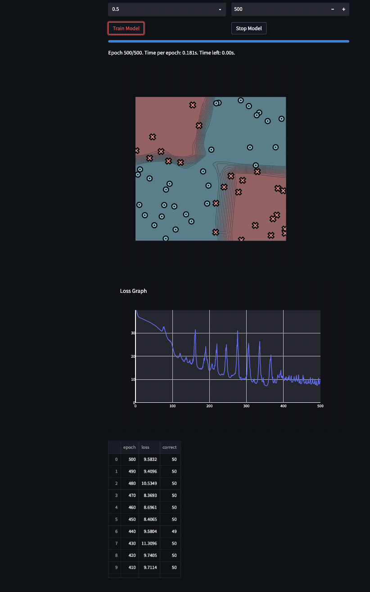
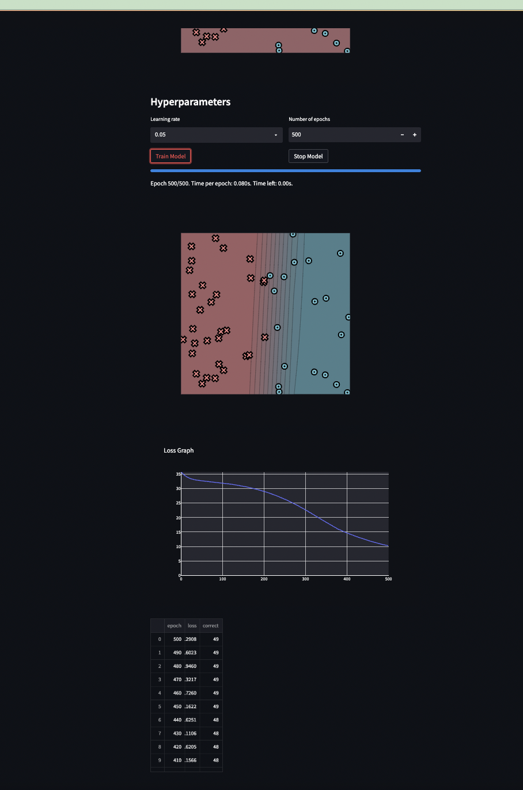
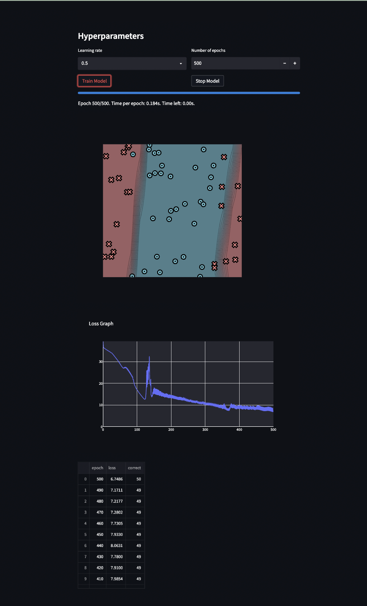
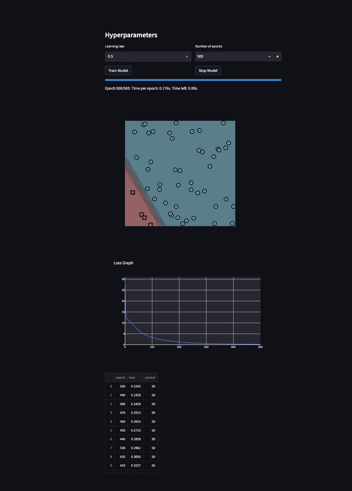
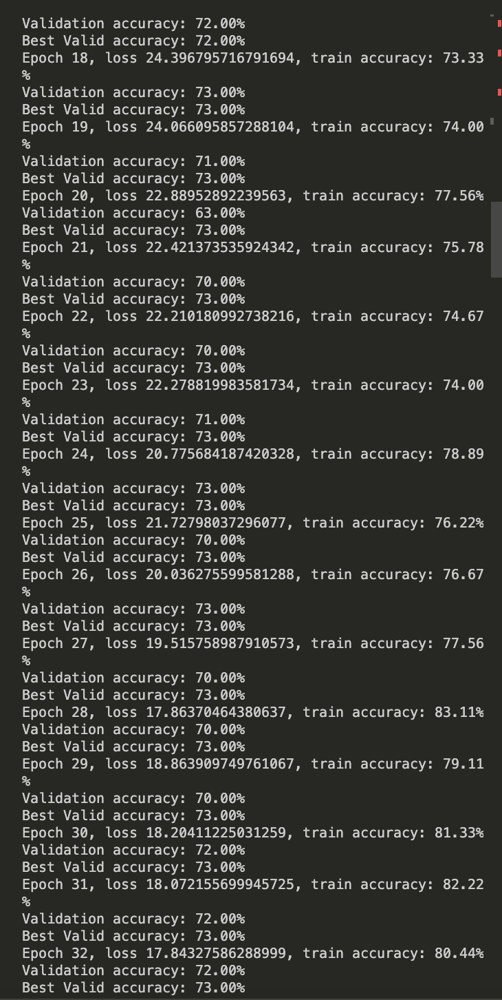

# Image Classifier - Machine Learning Engineering Project

#Overview 
I built an Image Classifier that attained 96% accuracy by implementing PyTorch fundamental modules from scratch listed below. After building the fundamentals  In addition, I enhanced 25% computation efficiency through parallel programming on GPU with NumbaJit and CUDA.

1) Auto Differentiation
2) Back-Propagation
3) Tensor Broadcasting
4) Derivative and Scalar programming.

NLP and CV training scripts in project/run_sentiment.py and project/run_mnist_multiclass.py. This script has the same basic training setup as :doc:module3, but now adapted to sentiment and image classification. You need to implement Conv1D, Conv2D, and Network for both files. Use Streamlit for visualization.

# Visualization on Different Data Set
Xor Data Set:

Simple Data Set:

Split Data Set:

Diag Data Set:

My guidance: 

* Docs: https://minitorch.github.io/

* Overview: https://minitorch.github.io/module4.html

# Sentiment and NMist Result

   
        
